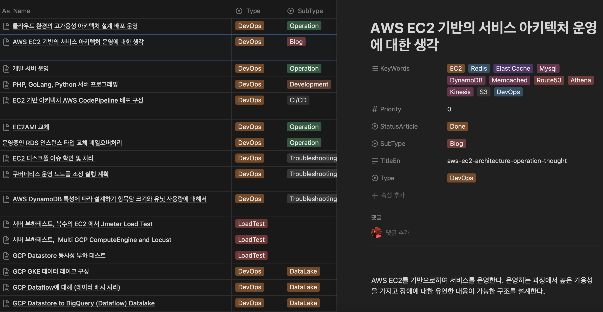
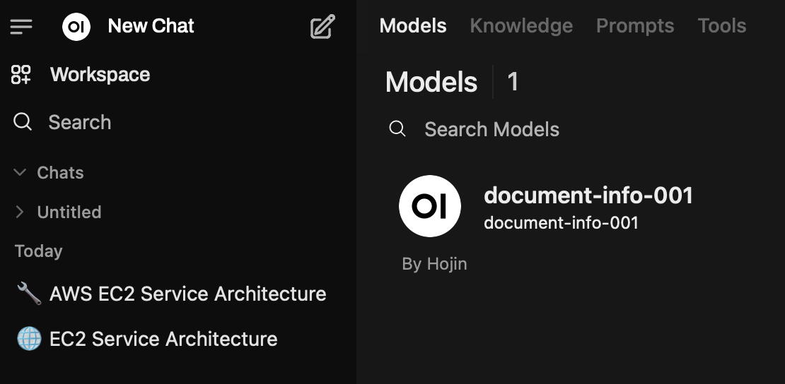
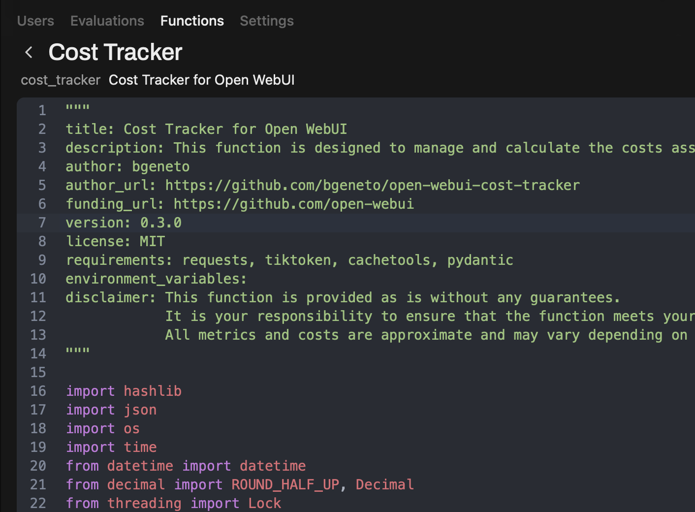
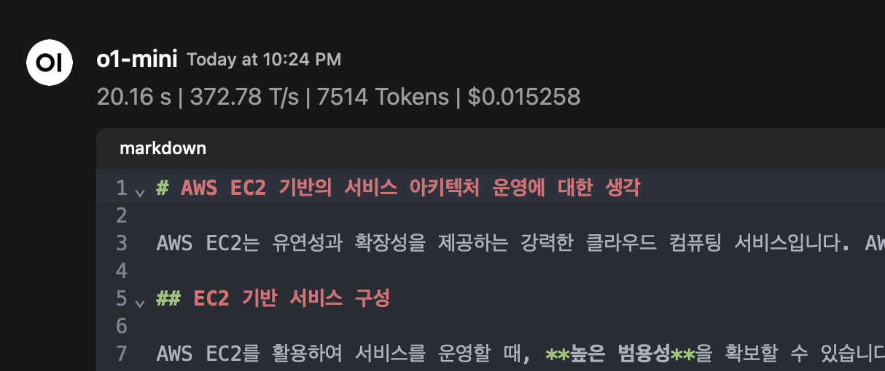

# AI와 함께 기술 글 쓰는 방식

업무 중 마주했던 기술적 이슈들과 그 해결 과정, 그리고 진행했던 작업들을 기록하게된 이유중 하나는 이번에 토스에서 공개한 테크니컬 글쓰기에 대한 포스팅이 큰 영감을 줬기 때문입니다.

[Technical Writing Tutorial](https://technical-writing.dev/tutorial/review-prompt.html)

특히 후반부의 AI와 함께 쓰기 부분은 그동안 글쓰는데 힘들었던 부분에 대해 해쳐나갈 방법에 대한 영감을 주었습니다. 테크니컬 글쓰기는 수려한 문장으로 상대방을 감동받게 하는걸 목표로 하기보다는 의도한 바를 잘 전달하는게 중요하다고 느꼈습니다. 그렇다면 나도 내가 가진 기술들을 활용해서 내가 작성한것 보다 한층 더 전달력 있게 글을 작성하고 또, 보다 쉽게 퍼블리싱 할 수 있겠다 싶었습니다.



먼저, 노션 데이터베이스로 작성할 글들의 초안을 관리하고 있습니다. 내용을 채워나가는 과정에서는 의식의 흐름대로 혹은 간단히 정리된 상태로 글을 작성합니다. 그런 다음, 구조화된 형태로 만들기 위해 LLM을 활용합니다. 제가 사용한 환경은 다음과 같습니다.

```jsx
- MacBook Air 2020 Apple M1 16GB
- Docker
- Open WebUI
- OpenAI GPT-4, 4mini API
```

로컬 환경에서 OpenAI의 모델을 Attach한 Open-WebUI를 사용하여 로컬 LLM 환경을 구성했습니다.

[Open-WebUI GitHub Repository](https://github.com/open-webui/open-webui)

이 프로젝트의 README.md가 잘 작성되어 있으며, OpenAI API Key를 활용한다면 다음 명령어로 간편하게 부팅할 수 있습니다.

```jsx
docker run -d -p 3000:8080 -e OPENAI_API_KEY=your_secret_key -v open-webui:/app/backend/data --name open-webui --restart always ghcr.io/open-webui/open-webui:main
```

이 환경에서 저는 다음 두 가지 작업을 통해 사용하고 있습니다.

1. 모델 추가



   System Prompt에 제가 원하는 포맷의 테크니컬 글쓰기 프롬프트를 작성해 두었습니다. 아직 고도화되지는 않았지만, 나름대로 좋은 결과물을 내주고 있습니다. 또한, 토스의 테크니컬 글쓰기에서 일부 아이디어를 가져왔습니다.

   ```jsx
   # 역할
   이 봇의 역할은 기술 문서의 구조를 분석하고, 아래의 원칙들을 반영하여 문서를 개선하는 것이다.
   문서는 Markdown 형태로 작성한다.
   기본적인 형태는 아래 템플릿 구조로 작성한다.
   반환은 코드블럭으로 묶은 Markdown 형태로 반환한다.

   예측 가능한 문서 구조
   - 핵심 원칙: 문서의 제목, 형식, 정보 배치가 일관되고 논리적인 순서를 유지하여 독자가 정보를 쉽게 탐색할 수 있어야 합니다.
   - 체크리스트:
     - 동일한 수준의 제목과 소제목이 일관된 패턴을 따르는지
     - 기본 개념부터 점진적으로 상세 내용이 배치되어 있는지
     - 용어가 일관되게 사용되는지
   가치를 먼저 제공하기
   - 핵심 원칙: 기능이나 세부 설정보다, 독자가 문서를 통해 얻을 수 있는 구체적인 가치나 문제 해결 효과를 먼저 전달해야 합니다.
   - 체크리스트:
     - 문서 도입부에서 독자가 얻을 이점이 명확하게 제시되어 있는지
     - 부수적인 세부 정보는 후순위로 배치되어 있는지

   # 템플릿

   # [문서 제목]

   ## 문제 정의

   [문서에서 풀어가고자 하는 문제 사항을 정의]

   ## 개요

   [작업에 대한 간단한 정의와 설명 해당 작업으로 얻는 기대 효과를 정의]

   ## 배경 지식

   [작업을 이해하기 위한 배경 지식에 대해서 사전 정의]

   ## 작업 내용

   [작업에 대한 개요를 정의]

   [작업 세부 작업 내용 전달]
   ```

2. 필터 추가

   코스트 트레킹을 위한 필터를 추가했습니다. LLM을 사용하는 동안 어느 정도 비용이 발생하는지, 전역 Filter를 사용하여 확인할 수 있습니다.

   
   
   [Open-WebUI Cost Tracker](https://github.com/bgeneto/open-webui-cost-tracker)

   

글쓰기에 AI를 활용하는 방법은 무궁무진할 것 같습니다. 다양한 서비스가 있으며, ChatGPT를 활용하는 방법도 있습니다. 하지만 개인 환경에 맞춰 자유롭게 튜닝 가능한 환경을 구성하는 것은 또 다른 가능성의 시작이라고 생각됩니다. 또한, 동료 개발자들과 이야기를 나누다 보면, 같은 AI 서비스라도 각기 다른 방식으로 사용하고 있으며, 모르는 유용한 서비스들도 존재합니다. 

이 내용이 크지 않을지라도 서로 간에 공유되어 도움이 되었으면 좋겠습니다.