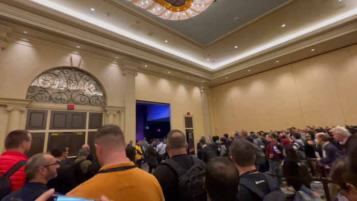
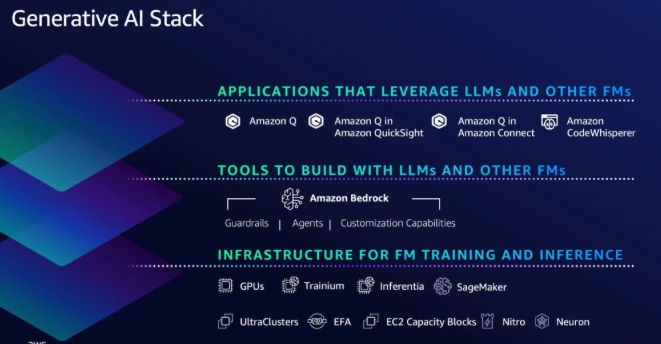
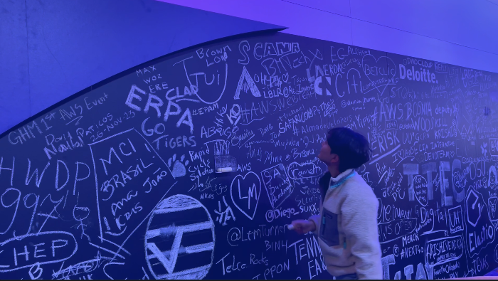
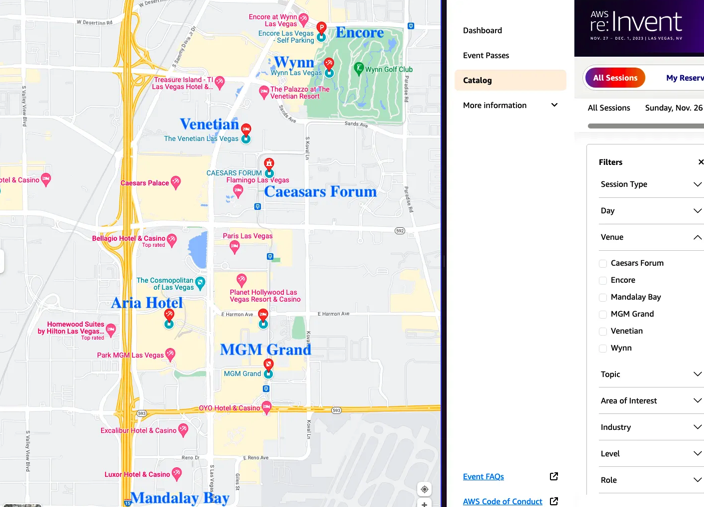
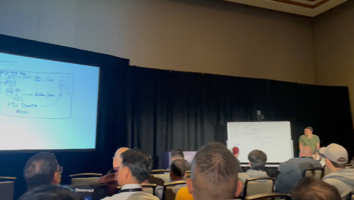
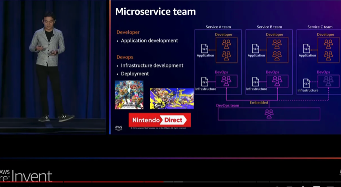
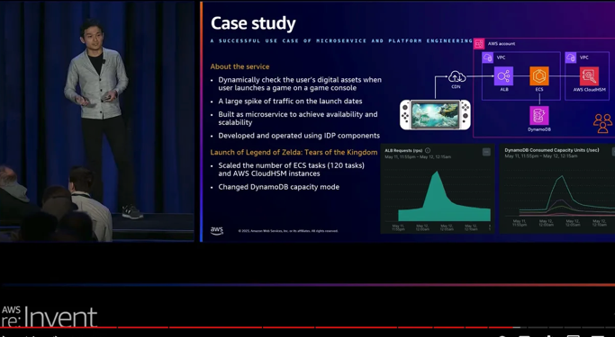
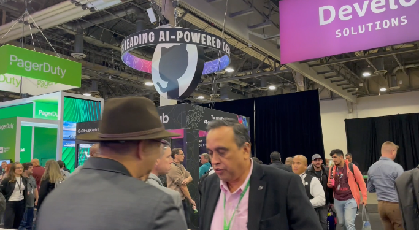
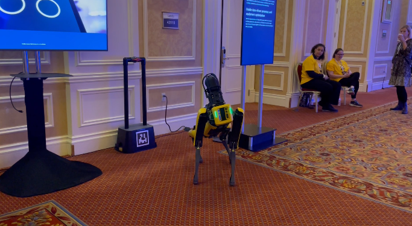
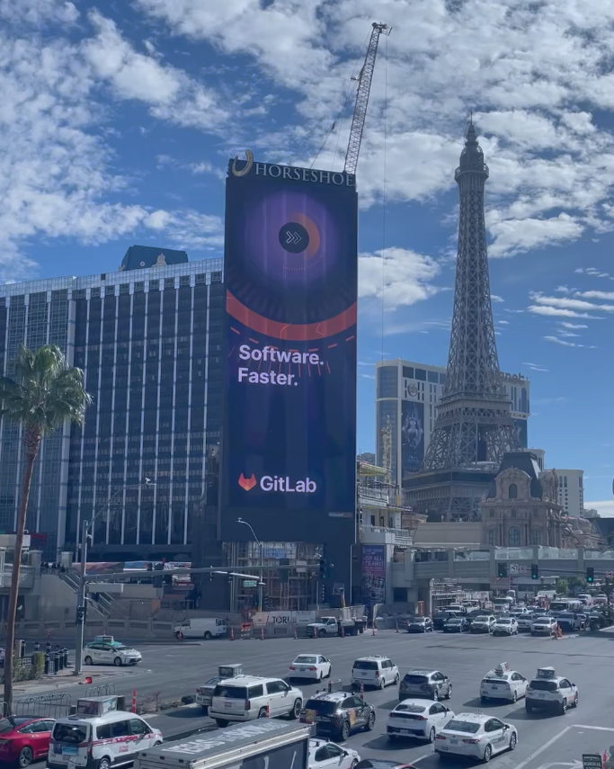

# aws-reinvent-2023

AWS re:Invent 2023

## Keynote 주요 내용

### AWS re:Invent 2023 - CEO Keynote with Adam Selipsky ([link](https://www.youtube.com/watch?v=PMfn9_nTDbM))

CEO 키노트는 주로 생성형 AI 기술과 관련되어 있었습니다.

1. **AI 기술 향상과 환경 구성:**
   - 생성형 AI 기반 기술에서 향상된 프로세싱 속도와 스토리지 활용 강조.
   - 쉬운 보드 튜닝 기술로 AI 기술 접근성을 향상.
   - 다양한 벤더사에서 사용 가능한 환경 조성.
2. **S3 속도 향상과 저렴한 비용:**
   - 향상된 S3 소개, 높은 성능을 저비용으로 제공 강조.
3. **NVIDIA와의 협력 강화:**
   - 엔비디아와의 협력 파트너쉽 강화.
   - 그래픽 카드 및 AI 최적화 칩셋 발표.
4. **베드락(Bedrock) 모델 소개:**
   - 베드락 모델 학습 및 커스터마이징 강조.
   - 모델 선택 및 설정을 통해 페르소나 주입 가능.
5. **다양한 서비스 및 기능 소개:**
   - 생성형 AI 서비스 코드 위스퍼나 큐 소개.
6. **큐 익스퍼트 서비스 소개:**
   - 큐 익스퍼트는 더욱 향상된 기업형 AI.
   - 외부 정보를 큐에서 종합하여 기업 맞춤 서비스를 제공.
   - 지라 티켓 생성이나 정보 요청 기능 제공.

- Amazon Generative AI 3 layer stack
  
- 신규 공개한 AI 서비스
  - [Amazon Bedrock](https://aws.amazon.com/ko/bedrock/): 개인화된 LLM 제공 서비스
  - [Amazon Q](https://aws.amazon.com/ko/quicksight/q/): AWS 리소스 기반 대화형 AI 시스템

## 엄청난 규모의 세션장

7개 호텔 사이의 세션 배치로 원하는 세션을 위치에 맞춰 계획해야 함.

## 세션 분위기

질의응답이 가능한 화이트보드 세션과 일반적인 강의로 나뉨

화이트보드 세션  

## 인상깊은 세션

### Modernization of Nintendo eShop: Microservice and platform engineering ([link](https://www.youtube.com/watch?v=grdawJ3icdA))

1. **클라우드 마이그레이션 및 현대화:**
   - 온프레미스에서 클라우드로의 마이그레이션 후 마이크로서비스 현대화 추진.
   - 복잡한 데이터 및 비즈니스 로직의 난이도 증가 문제.
2. **간편한 마이그레이션 포인트 설정:**
   - 서비스를 단위로 분리, 개발자와 데브옵스 협업.
3. **닌텐도의 현대화 및 데브옵스 성장:**
   - API 게이트웨이를 통해 지표 추출 및 확인.
   - "콩 게이트웨이" 언급.

데브옵스는 팀에 유동적으로 붙는다  

다이나모DB를 사용

# 엑스포

활발하고 자유로운 분위기로 다양한 경험 확보 가능

엑스포 전경  

AWS IOT와 결합한 제품 시연  

라스베가스 대형 전광판에 나오는 테크 업체 광고  

KeyWords: Conference  
Priority: 500  
Type: Conference
