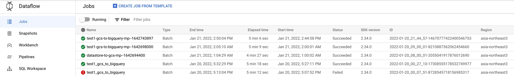
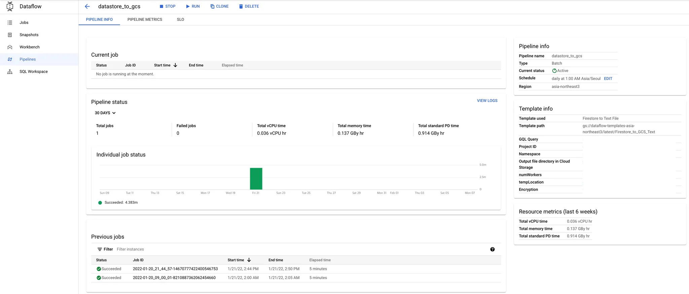
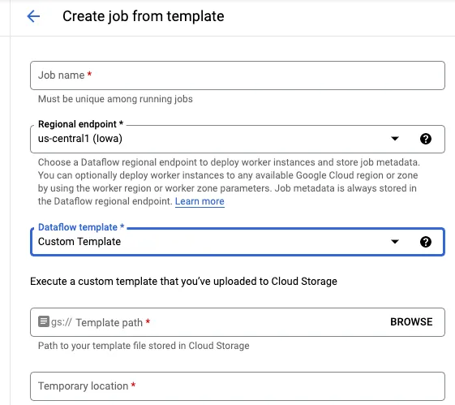

# GCP Dataflow의 데이터 배치 처리

## 문제 정의

현대의 데이터 처리 요구 사항은 대규모 데이터 셋을 효율적으로 처리하고 변환해야 하는 과제를 수반합니다. 이 문제를 해결하기 위해 GCP Dataflow가 제공하는 데이터 배치 처리 기능을 활용하는 방법을 살펴봅니다.

## 개요

GCP Dataflow는 Apache Beam을 사용하는 대규모 데이터 배치 처리 도구입니다. Dataflow를 활용하여 데이터 변환 파이프라인을 구축하면, 데이터 저장 및 분석 작업을 효율적으로 수행할 수 있으며, 클라우드 기반의 확장성을 활용하여 처리량을 조정할 수 있습니다. 이 문서에서는 Dataflow의 기본 구성 요소 및 작업 흐름에 대한 이해를 제공합니다.

## 배경 지식

- **Apache Beam**: 서로 다른 처리 엔진을 지원하는 데이터 처리 모델입니다. Dataflow의 기본 처리 모드로 사용됩니다.
- **Pipeline**: 데이터 변환 및 처리를 정의하는 기본 단위로, 일련의 데이터 처리 단계로 구성됩니다.

## 작업 내용

### Dataflow의 주요 구성 요소

#### 1. Jobs
Jobs는 Dataflow에서 각 파이프라인 실행 단위를 의미합니다. 하나의 파이프라인은 여러 작업 단위로 구성되며, 이들은 특정 데이터 변환 및 처리를 수행합니다.



#### 2. Pipeline
Pipeline은 각 작업 단계의 순서와 데이터를 처리하는 방법을 정의합니다. Apache Beam의 파이프라인 모델을 통해 데이터 변환 순서를 정의하며, 스텝별로 데이터가 처리됩니다.



#### 3. Template
Template은 미리 정의된 파이프라인 설정으로, 빠른 파이프라인 실행을 지원합니다. 사용자는 필요한 파라미터를 삽입하여 콘솔이나 CLI에서 쉽게 배포할 수 있습니다.

### 커스텀 개발

- Apache Beam을 활용하여 맞춤형 Dataflow 프로젝트를 개발할 수 있습니다.
- 기본 제공 템플릿을 사용하거나, GCS에 사용자 정의 템플릿 파일을 업로드하여 파이프라인을 생성합니다.
- Flex 템플릿을 활용하여 Docker 이미지를 기반으로 작업을 자동화할 수 있습니다.

1. **Pipeline 코드 개발**: Java, Python, Go로 개발 가능하며, 대부분의 레퍼런스는 Java로 제공됩니다.
    ```python
    def write_to_datastore(project, user_options, pipeline_options):
        """Creates a pipeline that writes entities to Cloud Datastore."""
        with beam.Pipeline(options=pipeline_options) as p:
            _ = (
                p | 'read' >> ReadFromText(user_options.input)
                  | 'create entity' >> beam.Map(
                        EntityWrapper(
                            project,
                            user_options.namespace,
                            user_options.kind,
                            user_options.ancestor).make_entity)
                  | 'write to datastore' >> WriteToDatastore(project))
    ```

2. **Dataflow 템플릿 생성 및 스테이징**: 작성한 코드를 통해 템플릿으로 변환하여 클라우드 스토리지에 업로드합니다.
    - Java의 경우 메이븐을 통한 빌드 단계가 필요합니다.

3. **Dataflow Pipeline 실행**: Dataflow 콘솔에서 업로드한 템플릿을 선택하고 파이프라인을 실행합니다.



### 샘플 코드

- **Java**: 
  - [DatastoreToText.java](https://github.com/GoogleCloudPlatform/DataflowTemplates/blob/HEAD/src/main/java/com/google/cloud/teleport/templates/DatastoreToText.java)
  - **Python**: 
  - [datastore_wordcount.py](https://github.com/apache/beam/blob/master/sdks/python/apache_beam/examples/cookbook/datastore_wordcount.py)

Apache Beam의 Python GCP 모듈에 대한 자세한 내용은 [Apache Beam Python GCP module](https://beam.apache.org/releases/pydoc/2.15.0/apache_beam.io.gcp.html)에서 확인할 수 있습니다.