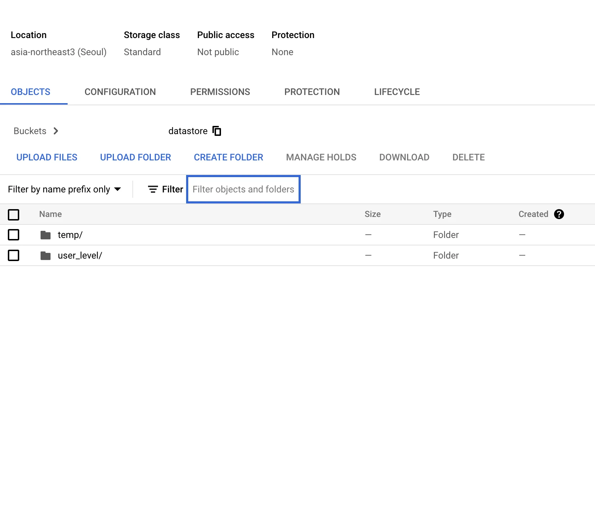

# GCP Datastore를 이용한 BigQuery로의 데이터 수집 (Dataflow 기반 데이터레이크 구축)

## 문제 정의

Datastore의 데이터를 일 단위로 BigQuery에 적재하여 지표 데이터로 활용할 수 있는 구조를 구축하고자 합니다.

## 개요

이 작업은 Datastore의 데이터가 매일 GCS에 Export된 다음, BigQuery에 Import되어 데이터레이크를 구축하는 과정입니다. 이를 통해 Dataflow를 이용해 데이터 흐름을 자동화하여 데이터 분석 및 리포팅에 필요한 기반을 마련합니다.

## 배경 지식

Google Cloud Platform(GCP)의 주요 데이터 서비스 간의 데이터 흐름을 이해하고 효율적인 데이터 관리를 위해 GCS, BigQuery, Dataflow 등이 활용됩니다.

## 작업 내용

### 1. 데이터 Export 및 Import 프로세스

1. **Datastore의 데이터를 GCS로 Export**
   - Datastore 데이터를 쿼리하여 Google Cloud Storage(GCS)에 날짜 정보를 포함하여 Export 합니다.
   - 이 Export 작업은 Datastore의 Kind 별로 GCS에 저장됩니다.

2. **GCS에서 BigQuery로 Import**
   - GCS에 백업된 데이터를 BigQuery로 Import합니다.
   - UDF(JavaScript 파일)와 스키마(JSON 파일)을 사용하여 데이터셋과 테이블에 적합하게 데이터를 가져옵니다.

### 2. Dataflow를 통한 데이터 흐름 자동화

- **Dataflow 사용**: 
  - Datastore 데이터를 텍스트 형식으로 GCS에 Export하고, 이를 다시 BigQuery로 Import 하는 Dataflow 파이프라인을 설정합니다.
  - 이 파이프라인을 통해 작업이 매일 자동으로 실행됩니다.

### GCS 디렉토리 구조

- **구조의 의미**: Datastore의 Kind 별로 GCS의 디렉토리가 구분되어 있습니다.
- **구성 요소**:
  - `udf.js`: Dataflow에서 데이터를 처리하기 위해 필요한 사용자 정의 함수.
  - `schema.json`: BigQuery에 데이터를 Import하기 위한 스키마 정의.

### Dataflow 파이프라인 일정

- **Export 및 Import 스케줄**:
  - 데이터 Export: 매일 오전 6시에 수행.
  - 데이터 Import: 매일 오전 7시에 수행.
- **수동 실행 가능**: 자동 수행되지 않았을 경우, 필요 시 수동으로 파이프라인을 실행할 수 있습니다.

### Data 관리 사항

- **파일 관리**:
  - Datastore Export 시, GCS 파일은 덮어쓰기되며 자동으로 파티셔닝됩니다.
  

- **데이터 적재**:
  - BigQuery로의 데이터 적재는 Append 형태로 이루어지며, 쿼리 시 날짜별 조건을 넣어 조회할 수 있습니다.

  
KeyWords: DataLake, GCP
Priority: 400
StatusArticle: Draft
SubType: DataLake
Type: DevOps
