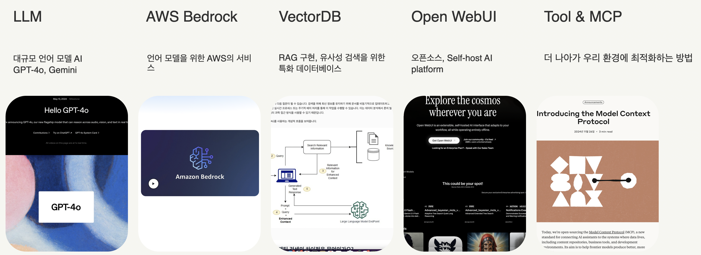
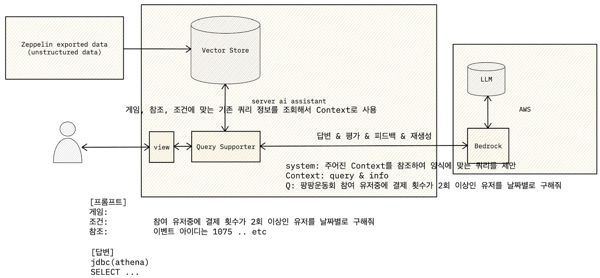

# LLM으로 BI 업무 효율화하기

## 문제 정의

다양한 조직에서 데이터 지표화 작업이 필요하며, 각자의 목적에 따라 데이터를 적합한 형태로 추출해야 합니다. 비즈니스 로직과 로그 관리 방식에 따라 가능 여부가 결정되며, 지표의 중요성에 따라 다른 팀과 협의해야 하는 경우도 많습니다. 복잡한 데이터를 다루는 경우, 쿼리 작성이 어려워 시간이 많이 소요되는 문제가 있습니다.

## 개요

LLM(대규모 언어 모델)의 발전으로 다양한 AI 에이전트가 등장하고 있습니다. 이를 활용해 데이터 지표 추출 업무를 효율적으로 개선하고, 특히 복잡한 데이터 쿼리 생성을 AI 기반의 툴을 만들어 업무 시간을 절약하고, 정확성을 높일 수 있습니다. LangChain 및 VectorDatabase를 활용해 프로토타입을 개발하면서 원리를 이해하고, 결과적으로는 Open WebUI를 통해 성공적인 시스템을 구축하고 있습니다.

## 배경 지식

- **LLM**: 대규모 언어 모델로, 다양한 데이터를 학습해 자연어 처리 문제를 해결합니다.
- **AWS Bedrock**: AWS에서 제공하는 AI 모델 서비스.
- **VectorDB**: 유사성 검색에 특화된 데이터베이스로, RAG(검색증강생성)를 구현하는 데 유용합니다.
- **Open WebUI**: 오픈소스 기반의 AI 플랫폼으로, 다양한 LLM 및 RAG 추론 엔진을 지원합니다.

## 작업 내용

### 초기 접근

- AWS Bedrock과 ChromaDB를 설정하고 Python의 FastAPI를 이용하여 AI 에이전트를 개발.
- AI 에이전트를 활용하며, 서버 업그레이드와 클라이언트 통합의 필요성을 느꼈고, 내부 데이터와의 효과적인 연결 및 통합이 중요하다고 판단.

### 최적화 시도

1. 기존 쿼리를 VectorDB에 임베딩하여 RAG를 도입.
2. 쿼리 결과를 LLM으로 평가하고 피드백을 통해 품질 개선.
3. 향상된 결과물을 다시 VectorDB에 임베딩하여 강화.

### Open WebUI 도입

자체 호스팅 가능한 사용자 친화적 AI 플랫폼인 Open WebUI 도입:

- 다양한 LLM 연결과 RAG 추론 엔진 내장.
- LLM, 시스템 프롬프트, 지식 베이스 등을 활용한 모델 구성.
- Python으로 개발한 도구 및 기능을 통합하여 모델 고도화.

### 모델(Workspace 구성)

**모델 구성:**

Open WebUI에서 모델은 LLM, 시스템 프롬프트, 지식 베이스, 도구, 필터 등을 종합적으로 설정한 개념입니다.

**지식 설정:**

RAG를 위해 필요한 지식 베이스를 업로드하고, 이를 VectorDB에 임베딩하여 저장합니다.

**기능 추가:**

Python으로 도구와 필터 등 원하는 추가 기능을 개발하여 모델에 통합합니다.

### 고도화 가능성

Tool & MCP를 사용하여 프로젝트별 외부 데이터와의 통합을 통해 모델을 고도화할 수 있습니다. 이를 통해 정확한 쿼리 생성이 가능하며, 데이터베이스, 구글 시트 등 다양한 소스를 활용할 수 있습니다.