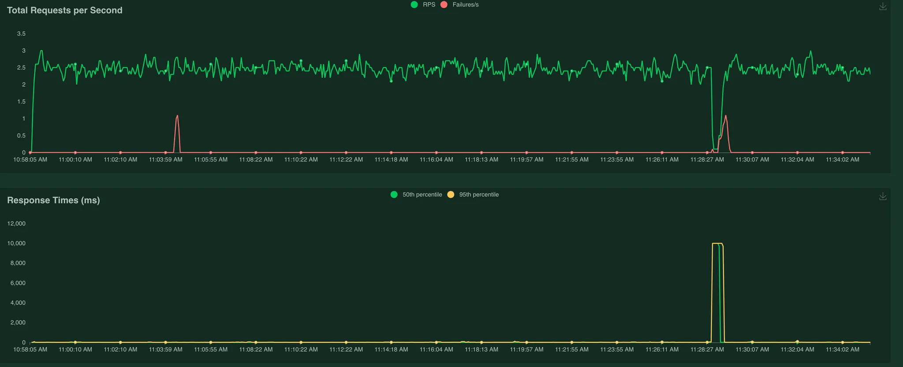
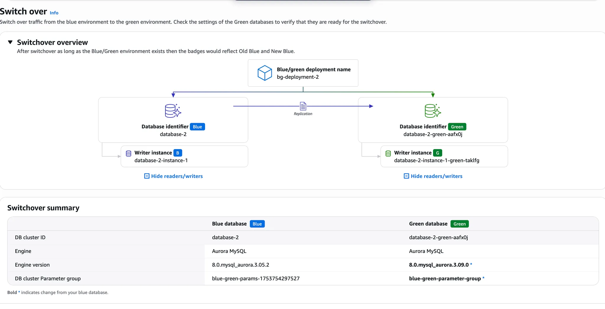
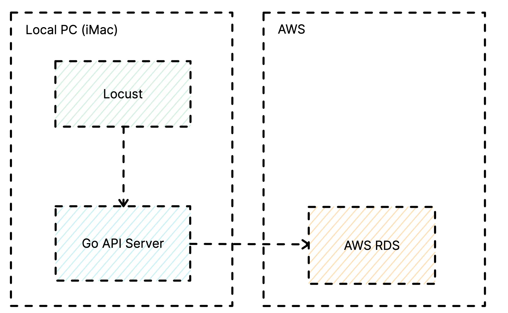

# AWS RDS 업그레이드 제로 다운타임 연구

## 개요

Amazon Aurora MySQL의 3.05 버전에 대한 지원 중단으로 인해 버전 업그레이드를 진행했다. 마이너 버전의 릴리즈만 있으며, RDS 클러스터에는 Blue/Green 배포 설정이 되어 있지 않았다. 해당 상황에서 서비스 영향도가 가장 낮은 방식의 업그레이드를 찾아 진행했다.

## 1안: 리더 추가 - 페일오버 방식으로 인스턴스 버전 변경

일반적으로 점검 예정인 인스턴스를 교체하는 것과 같은 원리로 리더 인스턴스를 추가한 후, 리더 인스턴스의 마이너 버전을 업그레이드하고 페일오버하여 교체시키는 전략을 생각했으나, 하나의 클러스터에서 일부 인스턴스의 엔진 버전을 변경할 수 없다. 

## 2안: AWS RDS에 Cluster Modify에서 바로 버전 변경

쓰기 인스턴스 단독 구성이나 쓰기 + 읽기 구성 모두 동일하게 다운타임이 발생한다. 읽기 인스턴스에서 먼저 업그레이드되더라도 쓰기 인스턴스가 변경될 때 다운타임이 발생하게 된다. 비어 있는 RDS에 대해 테스트 시 약 2분의 다운타임이 발생했다.

## 3안: AWS RDS Cluster 에서 블루/그린 배포 설정하며 버전 변경 진행

AWS RDS Console에서 지원하는 기능으로, RDS Blue/Green 배포 설정이 없는 상황에서 필요한 Cluster Parameter를 자동으로 추가하여 RDS Blue/Green 배포가 가능한 클러스터로 변경한 후 버전 변경을 자동으로 진행하는 기능이다.

`binlog_format` 같은 static parameter에 대한 변경이 필요한 경우 클러스터 재부팅이 요구된다.

엄밀하게 보면 두 번의 다운타임이 발생하지만, 두 번 다 길지 않다.

그리고 Switchover의 경우 앞으로 자주 사용하게 될 텐데, 요청을 바꾸는 과정에서 결국은 다운타임이 생기는 것에 대해서는 주의해야 할 것으로 보인다. 

- **Blue DB Instance restarted**: 약 20초 다운타임
- **Blue에서 Green으로 Switchover**: 약 20초 다운타임

## 참고 자료

### AWS RDS Blue/Green 배포를 사용한 Switchover 개요

### 업그레이드 간 요청 테스트 구조

- **AWS RDS Type**: db.t3.medium

