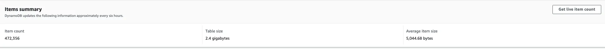
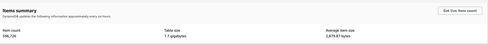
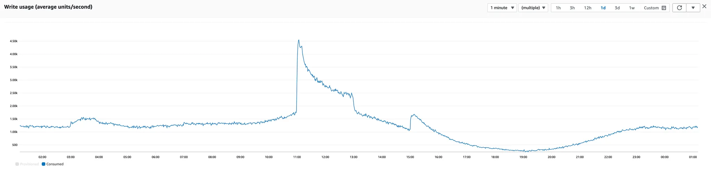

# AWS DynamoDB 설계 - 항목당 크기와 용량 사용량의 최적화

## 문제 정의

DynamoDB는 항목 크기가 커질수록 더 많은 쓰기 용량(WCU)을 소모하게 됩니다. 데이터베이스 설계 과정에서 이러한 특성을 고려하지 않으면 예기치 않은 비용 증가와 성능 저하(쓰로틀링)에 직면할 수 있습니다.  

## 개요

DynamoDB의 특성을 이해하고 데이터를 설계할 때 최악의 상황을 미리 방지함으로써 비용 효율적이고 빠른 접근성을 제공할 수 있습니다. 현재의 문제는 컬럼(속성)이 늘어나면서 쓰기 비용이 증가하고, 이벤트 핫타임 동안 쓰로틀링이 발생하는 것에 있습니다. 개선 없이 운영 시, 장기적으로 비용 증가와 성능 저하가 나타날 수 있습니다.

## 배경 지식

DynamoDB의 쓰기 용량은 다음과 같이 정의됩니다:

- **쓰기 용량 유닛(WCU)**: 최대 1KB 크기의 항목 하나를 쓰기 위한 초당 쓰기 용량 단위
  - 1KB를 초과하는 경우, 항목 크기(KB)에 비례하여 추가 WCU가 필요합니다.
  - 예: 3KB 항목의 표준 쓰기는 3개의 WCU가 필요합니다.
  [AWS 쓰기 용량 유닛(WCU)](https://aws.amazon.com/ko/dynamodb/pricing/provisioned/)

## 작업 내용

### 문제 분석

#### 현재 상태

- 평균 항목 크기(Average Item size): 5,044.68 bytes (5 KB)
- WCU 사용량:
  - 일반 이벤트: 3,000 WCU
  - 이벤트 핫타임: 최대 12,000 WCU

#### 테이블 구조

- 유저 ID를 키로 하여 이벤트를 관리
- 지나간 이벤트 데이터를 TTL 2개월로 보관으로 인해 큰 항목 크기 초래

### 개선 방안

**데이터 항목 크기 축소**

1. **이벤트 데이터 TTL 단축**: TTL을 2개월에서 1개월로 축소하여 비효율적인 데이터 저장을 줄임.

#### 결과

- 평균 항목 크기 감소: 5,044.68 bytes → 2,879.87 bytes

- WCU 사용량 감소:
  - 일반 이벤트: 1,500 WCU
  - 이벤트 핫타임: 최대 5,000 WCU

## 정리

| 항목당 평균 크기 | 쓰기 케파시티 (일반 이벤트 기간) | 쓰기 케파시티 (이벤트 핫타임 기간) |
|---|---|---|
| 5,044.68 bytes | 3,000 | 12,000 |
| 2,879.87 bytes | 1,500 | 5,000 |

DynamoDB는 항목당 크기에 따라 쓰기 케파시티 사용량이 크게 비례합니다. 이러한 특성을 고려하여 설계 초기 단계에서부터 효율성을 극대화하고 비용 절감을 도모해야 합니다.

---

**Keywords**: AWS, Cloud, DynamoDB, Troubleshooting
**Priority**: 200
**StatusArticle**: Draft
**SubType**: Troubleshooting
**TitleEn**: aws-dynamodb-wcapaticy-adjust
**Type**: DevOps