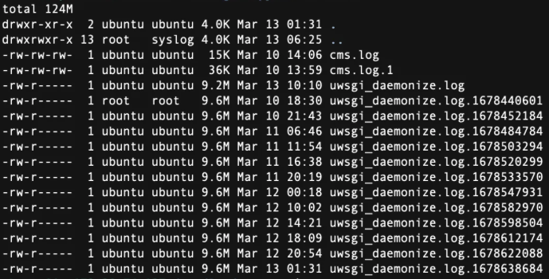

# EC2 디스크 사용량 초과 (DiskFull) 이슈 해결

## 문제 정의

웹 서비스의 공지사항 리스트가 로드되지 않으며, 이미지 업로드가 되지 않는 문제가 발견되었습니다. 이 문제의 원인은 EC2 인스턴스의 디스크 공간이 가득 찼기 때문입니다.

## 개요

디스크 공간이 부족하여 서비스가 정상적으로 작동하지 않는 상황을 해결하고, 향후 유사 문제의 재발을 방지하기 위한 자동화 조치를 구현합니다. 이를 통해 서비스의 연속성을 보장하고 시스템 가용성을 높일 수 있습니다.

## 배경 지식

EC2 인스턴스의 디스크 공간은 파일 로그, 애플리케이션 데이터 등에 의해 빠르게 소모될 수 있습니다. 특히 로그 파일은 지속적인 모니터링과 관리가 필요합니다. 로그 파일의 로테이션이 제대로 이루어지지 않으면 예상치 못하게 디스크 공간을 초과할 수 있습니다.

## 작업 내용

### 1. 디스크 사용량 확인

디스크 사용량을 확인하여 문제의 원인을 파악했습니다. 주요 문제는 uWSGI의 로그 파일이 비대해진 데 있었습니다.

```yaml
Filesystem      Size  Used Avail Use% Mounted on
udev            961M     0  961M   0% /dev
tmpfs           195M   23M  173M  12% /run
/dev/nvme0n1p1   49G   49G     0 100% /
tmpfs           975M     0  975M   0% /dev/shm
```

uWSGI 로그 파일이 불필요하게 37.6G 가량 누적되어 있었으며, 로그 로테이션이 권한 문제로 정상적으로 이루어지지 않았습니다.


### 2. 로그 파일 제거

비대해진 로그 파일을 제거한 후 웹 서비스가 정상적으로 기능하는 것을 확인했습니다.

### 3. 로그 로테이션 문제 해결

로그 로테이션이 권한 문제로 작동하지 않았습니다. 이를 해결하기 위해 다음 조치를 취했습니다.

- **로그 디렉토리 변경**: `uwsgi.ini` 파일을 수정하여 로그 저장 경로를 변경했습니다.
- **모니터링**: 변경 후, 로그가 정상적으로 쌓이고 로테이션되는지 모니터링하며 추가 조치를 결정했습니다.

### 4. 추가 조치 및 모니터링

- 로그가 잘 로테이션된다면 문제를 해결된 것으로 간주합니다.
- 만약 문제가 지속된다면 추가적 공지사항 로그를 중단하거나, 다른 관리 방안을 고려할 예정입니다.

### 5. 자동화 설정

주간 단위로 로테이션된 로그를 자동 삭제하도록 crontab을 설정했습니다.

```crontab
0 3 * * 1 rm /var/log/xxxxcms/uwsgi_daemonize.log.*
```

최근 로그는 필요시를 대비해 개별 파일로 유지하며, 불필요한 로그는 자동으로 삭제됩니다.

이 조치를 통해 시스템의 디스크 관리가 자동화되고, 서비스의 지속적 가용성을 확보할 수 있습니다.