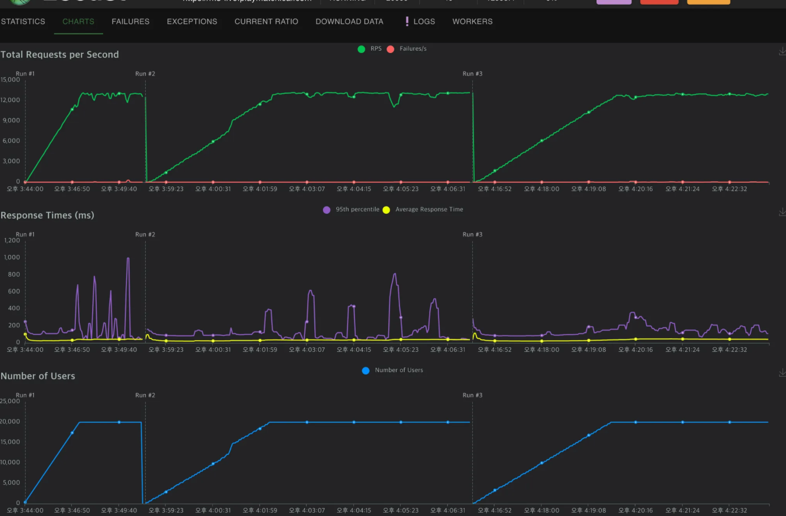
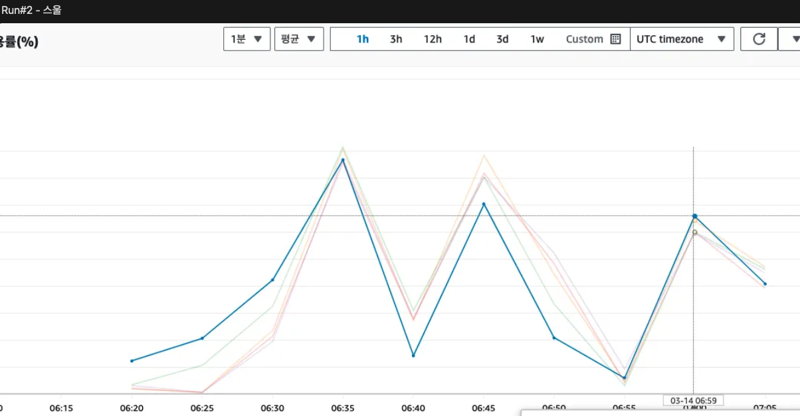
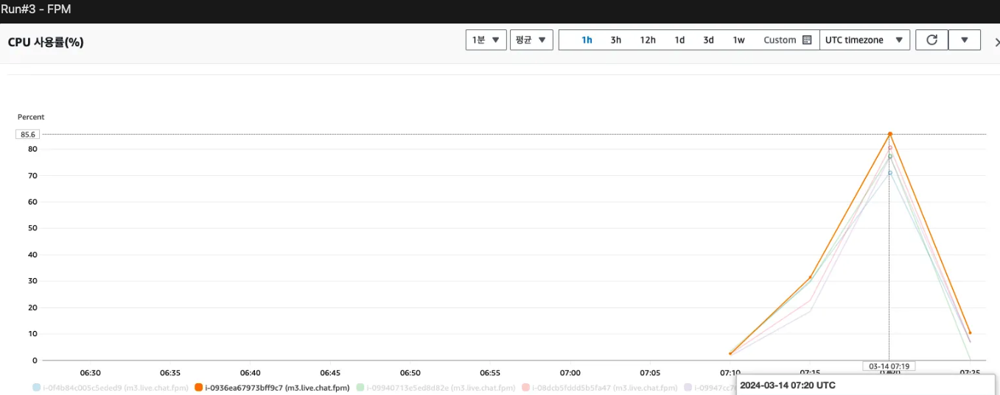
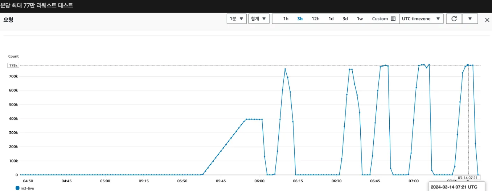
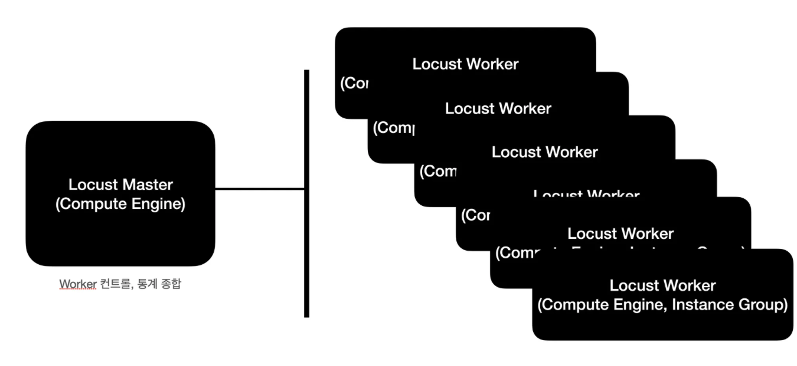
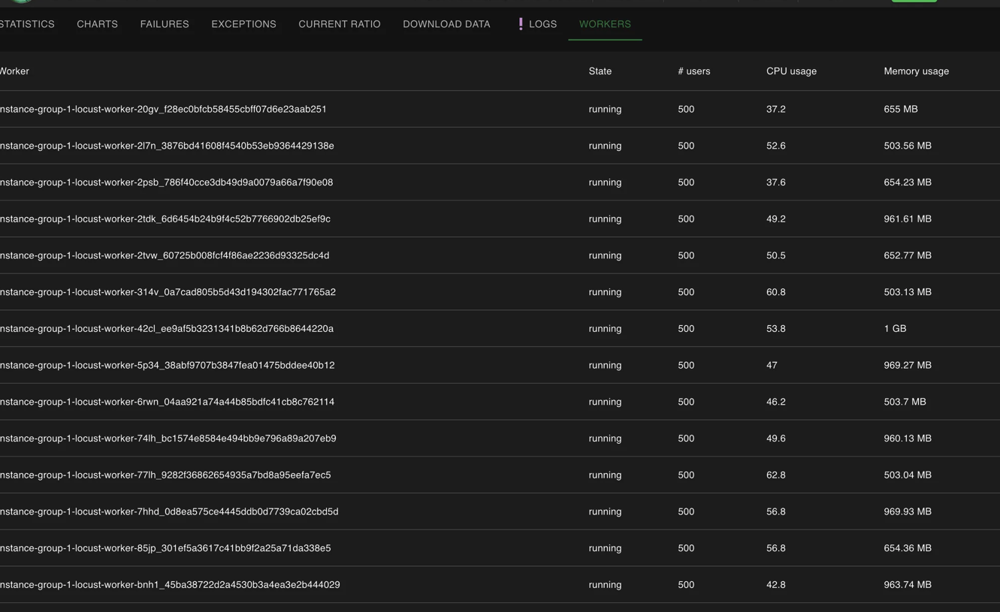
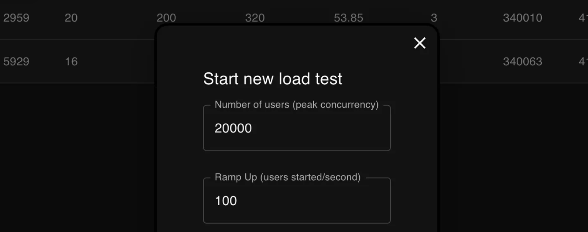

# 서버 부하 테스트: Multi GCP Compute Engine 및 Locust를 활용

## 문제 정의

게임 서버의 성능을 테스트하고 동시 접속자 수 및 RPS(Requests Per Second)를 확인하여 서버 자원의 한계를 평가합니다.

## 개요

게임 서버는 총 5대의 EC2 2xlarge 인스턴스로 구성되어 있으며, 각 인스턴스에서 PHP 7.2가 구동됩니다. GCP의 Compute Engine을 활용하여 대량의 부하를 발생시키고, Locust를 통해 부하 테스트를 자동화합니다.

## 게임 서버 스펙

- **인프라 구성**:
  - EC2 2xlarge 인스턴스 5대
  - PHP 7.2

## 부하 발생

- **부하 발생 환경**:
  - 워커 수: 40대 (GCP Compute Engine)
  - 최대 유저 수: 20,000명
  - 최대 RPS: 13,000 (약 분당 770,000 요청)

## 총평

- 2xlarge 타입의 EC2 인스턴스 5대로 구성된 환경에서 10,000 ~ 15,000명의 동시 접속(약 RPS 7,000)까지 무리 없이 처리할 수 있음이 확인되었습니다.
- 서로 다른 로드 밸런싱 기술(스울과 FPM)을 비교한 결과, 스울은 CPU 자원 소모가 더 낮으며 높은 요청 처리 한계를 가집니다.
- 기본적인 안정성을 봤을때는 둘다 비등하다.
- ALB는 문제 없이 요청을 처리하며, PHP 설정에 따라 EC2의 사용량과 안정성이 변화합니다. Redis 서비스는 충분한 여유 자원을 보이며, 성능 부하 측면에서 안정적인 모습을 보였습니다.









## Locust 테스트 구성

### 환경 구성

1. **Locust Master**: 하나의 Compute Engine에서 Locust 이미지를 Docker로 실행합니다.
2. **Locust Worker**: GCP 인스턴스 그룹으로 구성하여 스케일링을 통해 워커 수를 조절합니다.



### 테스트 코드

```python
from locust import HttpUser, TaskSet, task, between
import random

class ChatList(TaskSet):
    @task(1)
    def chatList(self):
        self.client.post("/xxxxx/v1.json", data={"xxx": "xxx", "xxx": "", "xxx": ""})

class ChatSend(TaskSet):
    @task(2)
    def chatSend(self):
        msg = getRandomMsg()
        self.client.post("/xxxx/v1.json", data={"xxxx": 1, "msg_type": 2, "xxx": "xxx", "xxx": xxx})

class User(HttpUser):
    wait_time = between(1, 2)
    tasks = [ChatList, ChatSend]

def getRandomMsg():
    json = {
        "phrases": [
            "Life is a journey that must be traveled no matter how bad the roads and accommodations.",
            ...
            "Do what you can, with what you have, where you are."
        ]
    }
    return json['phrases'][random.randint(0, len(json['phrases']) - 1)]
```

### Master 설정

Compute Engine 한 대를 Locust Master로 지정합니다.

```dockerfile
FROM locustio/locust:2.24.0
COPY . /mnt/locust
WORKDIR /mnt/locust
CMD ["-f", "locust.py", "-H", "{target_address}", "--master"]
EXPOSE 8080 8089
```

### Worker 설정

인스턴스 템플릿 구성 및 워커 수 동적 조절을 위한 구성입니다.

```dockerfile
FROM locustio/locust:2.24.0
COPY . /mnt/locust
WORKDIR /mnt/locust
CMD ["-f", "locust.py", "--worker", "--master-host", "locust-master"]
```

### 세팅 후 Locust에 잡힌 Worker



### 부하 세팅

1초당 증가할 유저 수를 Ramp Up 설정으로 조정합니다.



KeyWords: LoadTest, Loucust Priority: 300 Type: LoadTest